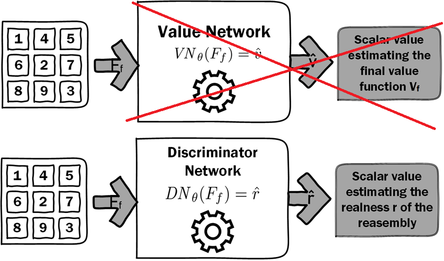
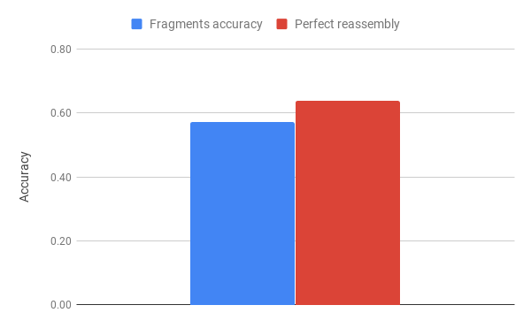
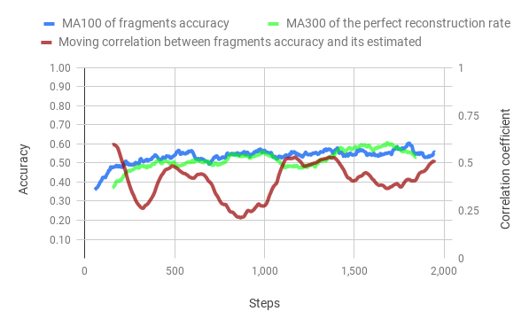

## Abstract 

In this paper, we are interested in solving visual jigsaw puzzles in a context where we cannot rely on boundary information. Thus, we train a deep reinforcement learning model that iteratively select a new piece from the set of unused pieces and place it on the current resolution. The pieces selection and placement is based on deep visual features that are trained end-to-end. Our contributions are twofold: First, we show that combining a Monte Carlo Tree Search with the reinforcement learning allows the system to converge more easily in the case of supervised learning. Second, we tackle the case where we want to reassemble puzzles without having a groundtruth to perform supervised training. In that case, we propose an adversarial training of the value estimator and we show it can obtain results comparable to supervised training.

______

## Introduction

The focus of this paper is the reassembly of jigsaw puzzles. Our puzzles are made from 2D images and divided in 9 same-sized squared fragments, while also considering an erosion between each fragment. The problem consists in finding the optimal absolute position of each fragment on the reassembly. Moreover, we want to find this set of optimal positions using, on the one hand an iterative process, and one the other hand a content-based pattern matching method.

<figcaption style="text-align: left;">
Image reconstruction from 9 unorganized fragments. On the left, a MNIST image is divided in 9 shuffled pieces. On the right side, it is perfectly reassembled. 
</figcaption>

During the last decade, deep convolutional architectures as become the norm in most pattern matching tasks involving 2D images. Therefore, we choose to use such methods in order to extract semantic information from fragments and the reassembly. We build on the method proposed by Paumard et al. <dt-cite key="paumard1"></dt-cite> that proposes to predict the relative position of a fragment with respect to another one, using a deep learning extractor and a bilinear feature aggregator.

In order to solve this problem, we construct this one as a Markov Decision Process, in order to solve it with a reinforcement learning (RL) algorithm. We build on the ExIt framework proposed by Anthony et al. <dt-cite key="DBLP:journals/corr/AnthonyTB17"></dt-cite> and the AlphaZero algorithm <dt-cite key="Silver1140"></dt-cite>, that proposes to use model based RL in conjunction with deep learning to guide the model exploration.
However, such methods enforce the presence of the ground truth to learn the semantic of our problem. Alternatively, we replace the state value approximator trained on the ground truth, by an adversarial discriminator trying to predict the realness of one puzzle reassembly. We show that using the discriminator's method not only provided similar accuracy compared to our value-based method, but also allow for faster convergence.

Our contributions are the following. First, a model based RL technique using a Monte Carlos Tree Search to compute simulations and two Neural Networks guiding the search and evaluating each final search's trajectory. And second, a variant using an adversarial training of the value estimator, allowing to tackle the case where we want to reassemble puzzles without having a groundtruth to perform supervised training.

______

## Problem formulation and formalism

From a set of fragments coming from the same image, we want to solve their best reassembly by assigning each fragment to its optimal position.

### Data representation

We want to introduce the notation of our data. $n$ is the number of fragments of a puzzle. $f_i$ is a flatten representation of the $i^{th}$ fragment given. $f_{empty}$ is a special fragment filled with zeros. $F$ is a puzzle reassembly (a n-sized vector of fragments). $F^*$ is the optimal puzzle reassembly.

### Goal, MDP and objective maximisation

Our goal being to find the optimal puzzle reassembly $F^*$. We want to consider this problem as a Markov Decision Process (MDP) in order to solve it with a reinforcement learning algorithm.
Starting from an initial state $s_0$, we want to assign each fragment $f_i$ to its optimal position $p$ by taking the $n$ optimal actions $a^*_i$.
More specifically, we want to find one optimal policy $\pi^*$ in order to find those optimal actions.

We define the notation part of the MDP formalism: $s_t$ is the state at step $t$ defined by the tuple $(F_t, R_t)$. With $F_t$ the puzzle reassembly at step $t$. $R_t$ an n-sized vector, $f_{empty}$ padded, of every fragment not used in $F_t$.
The initial state $s_0$ drawn from the start-state distribution<dt-fn>$s_0 \sim \rho_0(.)$</dt-fn>, is composed of $F_0$ an empty puzzle reassembly and $R_0$ an n-sized vector of fragments $f_i$. In fact, this start-state distribution is due to the uniform sample of a puzzle from the dataset.

An action is characterized by a fragment-position pair $a_t = (f_i, p)$. With $f_i$ a fragment from $R_t$ and $p$ a unassigned position of the reassembly $F_t$.
An action $a_t$ may be applied to a state $s_t$ using a deterministic transition function<dt-fn>$s_{t+1} = f(s_t, a_t)$</dt-fn>, creating the new state $s_{t+1}$. Thus, this transition function $f$ dictate the law of our synthetic environment.
$\left\{ a_i^* \right\}$ is the set of the $n$ optimal actions to take in order to solve the puzzle. In fact, this is due to the particularity of of our problem: no matter in what order the actions are applied the final reassembly $F_n$ will be identical.

A trajectory $\tau$, is a sequence of states and actions<dt-fn>$\tau = (s_0, a_0, s_1, a_1, ..., a_{n-1}, s_n)$</dt-fn> and $r_t$ is the reward for taking the action $a_t$ at state $s_t$, such that:
$$r_t = R(s_t, a_t) = \begin{cases} \frac{1}{n} & \text{if } a_t \in \left\{ a_i^* \right\} \\
0 & \text{if } a_t \notin \left\{ a_i^* \right\} \end{cases}$$

$R(\tau)$ is the finite-horizon undiscounted return of a trajectory<dt-fn>$R(\tau) = \sum_{t=0}^n r_t$</dt-fn>, while $\pi(s_t)$ is a policy that dictate witch action an agent should take in a given state<dt-fn>$a_t = \pi(s_t)$</dt-fn>.
Our central optimization problem is to optimize the expected return of our policy $\pi$ <dt-fn>$J(\pi) = \sum_\tau P(\tau|\pi)R(\tau) = \mathbf{E}_{\tau \sim \pi}[R(\tau)]$</dt-fn>, with $\pi^*$ being the optimal policy <dt-fn>$\pi^* = \arg \max_\pi J(\pi)$</dt-fn>.

### The ExIt framework <dt-cite key="DBLP:journals/corr/AnthonyTB17"></dt-cite>

Human reasoning consists of two different kinds of thinking. When learning to complete a challenging planning task, such as solving a puzzle, humans exploit both processes: strong intuitions allow for more effective analytic reasoning by rapidly testing promising actions. Repeated deep study gradually improves intuitions. Stronger intuitions feedback to stronger analysis, creating a closed learning loop. In other words, humans learn by thinking fast and slow.

<figcaption style="text-align: left;">
Expert Iteration (ExIt) is a general framework for learning that can result in powerful AI machines, without needing to mimic human strategies. ExIt can be viewed as an extension of Imitation Learning methods to domains where the best known experts are unable to achieve satisfactory performance. In standard Imitation Learning an apprentice is trained to imitate the behaviour of an expert. In ExIt, between each iteration, an Expert Improvement step is perform, where the apprentice policy is bootstrap to increase the performance of the expert. 
</figcaption>

______

## Overview: how does our method work?

The goal of this method is to find the optimal policy able to solve any puzzles from a specific dataset. In order, to achieve this goal we need to train a Reinforcement Learning (RL) algorithm able to find such policy.

We use a model based RL algorithm instead of less sample efficient algorithm such as Policy Gradients <dt-cite key="policygrad"></dt-cite> or DQN <dt-cite key="DQN"></dt-cite>. In particular, we use a Monte Carlos Tree Search (MCTS) <dt-cite key="MCTS"></dt-cite> to compute simulation in our synthetic environment and those simulations allow our algorithm for a slow-thinking phase instead of pure intuition. The MCTS is a strong playing strategy and is acting as the expert in the ExIt framework <dt-cite key="DBLP:journals/corr/AnthonyTB17"></dt-cite>, with $\pi_{MCTS}$ its policy.

<figcaption style="text-align: left;">
Knowing all the fragments of a puzzle, we are looking for the optimal assignment of each fragment:
 <b>First</b>, those fragments constitute the initial state.
 <b>Second</b>, a "dreaming phase" occurs with the MCTS simulating multiple trajectories (of paths) and the networks estimating their action-state values. After its dream, the MCTS should give us a strong estimated of the optimal action.
 <b>Third</b>, the transition function apply the optimal action on the actual state, giving us a new state. Again, this process is repeated until all fragments are assigned. 
</figcaption>

A first neural network, the Policy Network (PN) acts as the apprentice and try to mimic the expert policy $\pi_{MCTS}$.
Thus, after training the PN generates an apprentice policy $\pi_{PN}$, such that:
$$\pi_{PN} \approx \pi_{MCTS}$$

A second neural network, the Value Network (VN) acts as a Final Value Function ($V_f$) approximator. This VN approximate the finite-horizon return of the trajectory $\tau$ used to be in the final state $s_f$. Therefore, it evaluates the quality of a complete reassembly.
$$V_f(s_f) = R(\tau)$$

During the Expert Improvement phase we use the PN to direct the MCTS toward promising moves, while effectively reducing the branching factor. In this way, we bootstrap the knowledge acquired by Imitation Learning back into the planning algorithm. In addition, after each simulation we backpropagate finals state value estimated by the VN. Indeed, this let our algorithm solve puzzles without having access to the ground truth after training.

______

## Monte Carlo Tree Search

Monte Carlo Tree Search (MCTS) is an any-time best-first tree-search algorithm. It uses repeated game simulations to estimate the value of states, and expands the tree further in more promising lines. When all simulations are complete, the most explored move is taken.

### The search

Each search, consist of a series of simulated games by the MCTS that traverse a tree from root state until a final state is reached. Each simulation proceeds in four parts.

<figcaption style="text-align: left;">
<b>First</b>, a tree phase where the tree is traversed by taking actions according to a tree policy. <b>Second</b>, an expansion phase where child nodes are created from legal moves. <b>Third</b>, a rollout phase, where some default policy is followed until the simulation reaches a final state. <b>Finally</b>, the backpropagation of the final state value on its final parents nodes. 
</figcaption>

We describe here the MCTS algorithm used for our method; further details can be found in the pseudocode bellow.

The MCTS is a tree search where each node corresponds to a state-action pair $(s,a)$ composed of a set of statistics, $\left\{N(s, a), W (s, a), Q(s, a), P(s, a)\right\}$ <dt-fn>$N(s, a)$ the visit count, $W (s, a)$ the total action-value, $Q(s, a)$ the mean action-value, and $P(s, a)$ the prior probability of selecting $a$ in $s$</dt-fn>.
During the tree phase, actions are selected by choosing in in each state $s$ the action $a$ that maximise the UCB formula <dt-fn>$UCB(s,a) = Q(s,a) + U(s,a)$.
 $Q(s,a)$ is the mean value of the next state and $U(s,a)$ a function that increases if an action hasn't been explored much or if the prior probability of the action is high: $U(s,a) = C_{PUCT} P(s,a) \frac{\sqrt{N(s)}}{1+N(s,a)}$</dt-fn>.
Once a leaf node $s_L$ is reach we enter in the expansion phase. We use the PN to obtain a prior prediction $P$ over the action space by evaluating the leaf node <dt-fn>$P = \mathit{PN}_\theta(s_L)$</dt-fn>.

Then, we expand the tree by initialising each legal child node with a softmax normalisation <dt-fn>$p(s_L, a) = \frac{\exp(P_a)}{\sum_i exp(P_i)}$, such that $a$ and $i$ are legals actions.</dt-fn>.
We choose once again the action maximising the UCB formula, then the rollout phase begin where the default policy used is simply to choose actions uniformly from the legal ones. This random policy is followed until we reach a terminal state.

Finally, when the rollout is complete, we compute $\hat{v}$ <dt-fn>$\hat{v} = \mathit{VN}_\theta(F_f)$</dt-fn> an approximation of the Final Value Function with the VN. This estimated reward signal is propagated through the tree. Thus, all the parents visits counts and total action-value are updated in a backward pass.
At the end of the search, the action is return in function of its exploration during the search $N$. Two policies are used by the MCTS, one for competitive play and one for exploratory play.

### Exploration versus exploitation trade-off

On-line decision making involves a fundamental choice; exploration, where we gather more information that might lead us to better decisions in the future or exploitation, where we make the best decision given current information in order to optimize our present reward.
This exploration-exploitation trade-off comes up because we're learning online. We're gathering data as we go, and the actions that we take affects the data that we see, and so sometimes it’s worth to take different actions to get new data.

In order to explore our synthetic environment and not only acting greedily, we use three kinds of exploration processes : an Upper Confident Bound 
<dt-fn>To select a move during the simulation phase, we use the  Upper Confident Bound (UCB) score. Thus, we do not only act greedily over the mean estimation of an action $Q$, but we also estimate an upper confidence $U$, of what we think the mean could be. The UCB allow to select among the non-greedy actions according to their potential for actually being optimal, taking into account both how their estimates are to being maximal and the uncertainties in those estimates.</dt-fn>
, a Dirichlet noise onto the root's prior
<dt-fn>At the start of each search, we add a Dirichlet noise onto the root's prior to encourage the search to explore new actions: 
$X \sim Dir(\alpha)$ 
$p(s_{root}, a) = p(s_{root}, a) (1-\beta) + \beta X$ 
$\alpha$ is the parameter of the symmetric Dirichlet distribution and $\beta$ the parameter of the linear interpolation between the original prior value and a sample of the distribution.</dt-fn> and a softmax sample over the action's visit count to select a final action
<dt-fn>The search return the visit-count vector of the root's moves, $N_a = N(s_{root}, a)$. The move to play is either select stochastically for exploration or deterministically for competitive play. Therefore, during training the move is sample from the probability distribution over moves $a \sim \pi$ and in exploitation, greedily in respect to the visit counts $a = \arg \max_a N_a$. 
With: $\pi_a = Pr(a) = \frac{\exp(N_a)}{\sum_i exp(N_i)}$.</dt-fn>.
The first one is applied both during the training and the evaluation phase, while the other two, are only applied during the exploratory phase.

### Pseudocode of our search algorithm

<dt-code block language="python">
def mcts(game, policy_net, value_net):
    # Initialize root node
    root = Node()
    policy_net.expand(root, game)
    add_exploration_noise(root)
    for s in range(num_simulations):
        # Start a new simulation
        simu_game = game.clone()
        search_path = [root]
        action, node = select_child(root)
        simu_game.apply(action)
        search_path.append(node)
        # Tree policy
        while not simu_game.finished() and node.expanded():
            action, node = select_child(node)
            simu_game.apply(action)
            search_path.append(node)
        # Expansion
        if not simu_game.finished():
            policy_net.expand(node, simu_game)
            action, node = select_child(node)
            simu_game.apply(action)
            search_path.append(node)
        # Rollout phase
        while not simu_game.finished():
            action = random_action(simu_game)
            simu_game.apply(action)
        # Backpropagate the terminal value
        value = value_net.eval(simu_game)
        backpropagate(search_path, value)
    # Return the MCTS policy's action
    action = policy_mcts(game, root)
    return action
</dt-code>

______

## Functions approximators

In this method we use two Neural Networks working as functions approximators, the Policy Network (PN) and the Value Network (VN). In particular, the PN compute an estimation of the expert policy $\pi_{MCTS}$. Whereas, the VN estimate the Final Value Function, learning from the ground truth.

### Value Network architecture

We use a problem dependent neural network architecture $\mathit{VN}_\theta(F_f)$, with parameters $\theta$. This neural network takes the final reassembly $F_f$ as input and output a scalar value $\hat{v}$ estimating the finite-horizon return of the state's trajectory.

### Policy Network architecture

The Policy Network $P = \mathit{PN}_\theta(s_L)$, takes a state $s$ as input and outputs a move probability $P$ with components $P_a = Pr(a|s)$ for each action $a$.

More specifically, the PN takes $F$ and $R$ the couple composing the state $s$ as separated inputs. On the one hand, the reassembly representation is extracted using a first Feature Extraction Network (FEN1). On the other hand, each individual fragment representation of $R$ is extracted using a second Feature Extraction Network (FEN2), with shared weights. Both FEN architecture is either, depending on the image complexity: a fully connected network or a deep convolutional architecture followed by a fully connected classifier.

The features of each FEN are then combined through a Combination Layer (CL). We use a bilinear product in order to optimally capture the spacial covariances among the features. In particular, we use this bilinear layer:
$$Y_{i,p} = \mathit{\varnothing FEN2}(f_i)^T W_p \mathit{\varnothing FEN1}(F)$$
With, $\mathit{\varnothing FEN1}(f_i)$ and $\mathit{\varnothing FEN2}(F)$ the output of the first and second FEN respectively inside the ensemble $\mathbb{R}^D$ and $\mathbb{R}^{D'}$; $W$ is a learnable tensor, such that $W = (w_{p,d,d'})_{p \in P, d\in D, d' \in D'}$, $P$ the number of positions in the puzzle; $Y$ is the output of the CL, such that $Y = (y_{i,p})_{i \in N, p\in P}$.

Finally, we flatten the output $Y$ of the CL such as $Y'_a = Y_{i,p}$, with $a = (i, p)$ an action and we apply a softmax normalization <dt-fn>$P_a = Pr(a) = \frac{\exp(Y'_a)}{\sum_i exp(Y'_i)}$</dt-fn> to get the move probabilities $P$.

### Training

Our algorithm learns these move probabilities and value estimates entirely from self-play; these are then used to guide its search for future reassembly.

At the end of each reassembly, the final reassembly is scored according to the cumulative reward of the environment $R(\tau)$. The VN parameters are updated to minimize the error between the predicted outcome $\mathit{VN}_\theta(F_f)$ and the environment outcome. While the PN parameters are updated to maximize the similarity of the move probabilities vectors $P$ to the search probabilities $\pi_{MCTS}$. Specifically, the parameters are adjusted by gradient descent with a mean-squared error for the VN loss and a cross-entropy for the PN loss.

______

## Puzzle reassembly using Reinforcement Learning with discriminative value estimation

In this section, we will present a variant of our algorithm that doesn't need to have access to the ground truth during training (the optimal reassembly). This variant is inspired from the concept of discriminative value estimation for puzzle reassembly, introduced by Loïc Bachelot in an unpublished paper. In a first time, this concept will be summarized and in a second time our variant will be introduced.

### Discriminative value estimation

This method can be seen as a mixture between an Actor-Critic <dt-cite key="actorcritic"></dt-cite> and a Generative Adversarial Network <dt-cite key="GAN"></dt-cite> methods. The actor is also a generator and try to reassemble the puzzle. The critic is also a discriminator and try to predict the reassembly realness. Both the actor and critic are neural networks that are trained through backpropagation.

<figcaption style="text-align: left;">
The discriminator is trying to make the difference between real images and reassembly images coming from the generator. Then, the prediction of the discriminator is used to train the generator. If the discriminator's prediction is good, actions chosen by the generator are reinforced. Otherwise, if the prediction is low actions chosen are negated. 
</figcaption>

This discriminative-based technique is promising because it can be trained without having access to the ground truth, but it doesn't perform very well compared to a deep learning classifier baseline.

### Our variant

We merged the concept of discriminative value estimation to our previous method.
Instead of the Value Network (VN), we replace this one with the discriminator network described above.
The network architecture of the discriminator is the same as the VN architecture.
The discriminator is trained (relatively) in the same way: by trying to classify where the reassembly comes from: from real images or generated by our algorithm?

Since we don't have value estimated by the VN we directly use the probability estimated by the discrimator network.
Therefore, instead of estimating the cumulative reward of the trajectory, we try to estimate the realness of the reassembly.

The goal of this merged version is to keep the best of both worlds. On the one hand, the reassembly look-ahead of the Monte Carlo Tree Search, on the other hand, the "unsupervised" setup of the discriminator value.

______

## Experiments

We tested our methods for different kinds of datasets with different setups. First, we present the results of the MNIST dataset, second we consider an erosion of the MNIST images, then on the MNIST SVHN dataset and finally we present some preliminary results on a high resolution dataset.
Two metrics are used in order to evaluate our methods. On the one hand, the fragments accuracy is the percentage of perfectly position fragments, on the other hand, the perfect reconstruction is a pixel-wise difference with the original image with a 10-pixel threshold.
Experiments have been performed on a standard deskop machine without any kind of dedicated GPU.

### MNIST

We tested on the MNIST dataset because the images are small enough for us to train the complete network and search for relevant hyper-parameters.

<figcaption style="text-align: left;">
Mnist Puzzles examples. Our puzzles are made from 2D images and divided in 9 same-sized squared fragments. 
</figcaption>

#### Evolution of the performance metrics throught training

In figures bellow, we can observe the evolution of accuracy thought the training of both methods. The training time of the merged method is 5 times smaller than the classic method. However, the correlation of the Value Network to the fragments accuracy is a lot stronger than the Discriminator Network, we train the VN to directly estimate this value so this not a surprise.

<figcaption style="text-align: left;">
Evolution of puzzle reconstruction accuracy through training for the classic method. The coefficient correlation is calculated on the last 100 values, then a MA10 is used to smooth the curve. MA10 : Moving Average on 10 steps. 
</figcaption>

<figcaption style="text-align: left;">
Evolution of puzzle reconstruction accuracy through training for the merged method. 
</figcaption>

#### Influence of the number of simulations after training on the performance

In the figure bellow, we can see that the increase in the number of simulation increase logarithmically the accuracy. Also, both the classic method and the merged method give similar results, however, if the number of simulations is too low the merged method's accuracy is dropping. It may seem surprising that the merged method works so well without having access to the ground truth during the training phase.

<figcaption style="text-align: left;">
Accuracy of the two methods in test-time, with different numbers of simulations in the MCTS. 
</figcaption>

#### Merged method on eroded fragments

We decided to test our merged method using erosion between fragments (more than 10% of the image).

<figcaption style="text-align: left;">
Pathological case puzzle reassembly on MNIST with erosion. Top row: reconstruction; bottom row: perfect image. 
</figcaption>

The test time result is really good , especially on the perfect reassembly metrics. During the training we observe both accuracy being more or less equal, while the correlation coefficient is not in the best shape ever.

<figcaption style="text-align: left;">
Accuracy of the merged method in test-time. 
</figcaption>

<figcaption style="text-align: left;">
Evolution of puzzle reconstruction accuracy through training for the merged method on MNIST with erosion. 
</figcaption>

### MNIST SVHN

After playing around with MNIST, we wanted to go further on the image complexity. Therefore we try our methods on MNIST SVHN, bellow some promising reconstructions.

<figcaption style="text-align: left;">
Pathological case puzzle reassembly on MNIST SVHN. Top row: reconstruction; bottom row: perfect image. 
</figcaption>

On this dataset, with a really short training time (the accuract kept going up, but we had to cut the experiment), we achieve high fragments accuracy.

<figcaption style="text-align: left;">
Accuracy of the classic method in test-time. 
</figcaption>

<figcaption style="text-align: left;">
Evolution of puzzle reconstruction accuracy through training for the classic method on MNIST SVHN. 
</figcaption>

### Car dataset <dt-cite key="car_dataset"></dt-cite>

Looking forward to testing our method on a dataset with high resolution images, we did some quick training onto a car dataset using a VGG16 pre-trained on ImageNet as a feature extractor.

<figcaption style="text-align: left;">
Promising results on the car dataset. 
</figcaption>

Our method did show some promising reconstructions, nonetheless the training time was really too short given the compute availaible.
We achive 20% accuracy for the well positioned framents and a few perfect reassembly, that is still better that random and therefore show that our method should work with more time and compute available.

______

## Related Work

Our project was inspired by  several research articles which aim at solving this very problem using such techniques as deep learning. Other articles were unrelated to our purpose, but we adapted techniques described in there for our project purpose.

### Review of puzzle solving methods

Most publications of this field <dt-cite key="border1,border2"></dt-cite> rely on the border irregularities and aim for precise alignment. These methods perform well on a small dataset with only one source of fragments. However, they are fragile towards erosion and fragment loss.

Without being interested in jigsaw puzzle solving, Doersch et al. proposed a deep neural network to predict the relative position of two adjacent fragments in <dt-cite key="doersch2015unsupervised"></dt-cite>. The authors show their proposed task outperforms all other unsupervised
pretraining methods. Based on <dt-cite key="doersch2015unsupervised"></dt-cite>, Noroozi and Favaro <dt-cite key="noroozi"></dt-cite> introduce a network that compares all the nine tiles at the same time. Those papers do not focus on solving a jigsaw puzzle but, on understanding the spatial structure of images by building generic images features.

However, Paumard et al. in <dt-cite key="paumard1"></dt-cite> and <dt-cite key="paumard2"></dt-cite> directly attempt to solve those kind of problems with the use of deep learning and based on the method proposed in <dt-cite key="doersch2015unsupervised"></dt-cite>. Moreover, they bring two significant innovations with their method. First, they consider the correlations between localized parts of the fragments using the Kronecker Product of the feature vectors. Thus, directly using the spacial correlation allow for faster convergence than the concatenation of the feature vectors used in <dt-cite key="doersch2015unsupervised"></dt-cite>. Additionally, they look for a complete fragment reassembly which they performed using the neural network predictions to build a shortest path graph problem. Therefore, achieving a significant accuracy increase over a pure greedy policy. Taken together, they obtained results that outperformed the previous state of the art in jigsaw puzzle solving.

<figcaption style="text-align: left;">
Overview of the method of Paumard et al. Knowing a central fragment, we are looking for the correct arrangement to reassemble the image.
Their method works in the following way:
 <b>First</b>, they use deep learning in order to extract important features of each image fragments.
 <b>Then</b>, they compare each couple of fragments features to predict the relative position of the two tiles, through a classifier.
 <b>Finally</b>, they solve the best reassembly by computing the shortest path problem  given the relative positions of each couples provided. 
</figcaption>

More specifically, the model perform quite well when we give it only the 9 accurate fragments. However, if we try to delete or to add outsider fragments to the puzzle, the accuracy decrease strongly. Furthermore, the increase of computation time is reasonable as long as the puzzle still contains 9 pieces, but any increment of the number of pieces leads to an factorial increase of the number of solution. Thus, the reassembly problem is NP-hard and the problem become quickly intractable.

### MCTS based methods

As we seen, STOA methods like <dt-cite key="paumard2"></dt-cite> suffer indeed from serious scaling issues. In this research project, we are looking to solve the scaling problem of the jigsaw puzzle reassembly. In particular, we are looking to scale both in terms of the size of the puzzle and the size of the fragments ensemble.

More specifically, we are looking to use a similar approch as <dt-cite key="doersch2015unsupervised"></dt-cite> and <dt-cite key="paumard1"></dt-cite> in order to extract vector features from our images and then to compute the position likelihood of each fragments. On the other hand, instead of solving the shortest path problem using an expensive optimal algorithm like Disjtra in <dt-cite key="paumard2"></dt-cite>, we want to tackle this by using an heuristic search based algorithm, thus speeding up the process of evaluating the shortest path in our graph. Thus, we will be able to compute larger graphs in a reasonable time frame.

Here we propose to used a deep reinforcement learning algorithm such as Alpha Zero <dt-cite key="Silver1140"></dt-cite> in order to learn the heuristic function only from self-play. AlphaZero is a more generalized variant of the AlphaGo Zero <dt-cite key="AlphaGoZero"></dt-cite> algorithm, that accommodates, without special casing, a broader class of game rules (chess and shogi, as well as Go). Their results demonstrate that a general-purpose reinforcement learning algorithm can learn, tabula rasa (without domain-specific human knowledge or data) superhuman performance across multiple challenging games.

Instead of a handcrafted evaluation function and move-ordering heuristics, AlphaZero uses a deep neural network. This neural network takes the board position as an input and outputs a vector of move probabilities and a scalar value estimating the expected outcome of the game from position. AlphaZero learns these move probabilities and value estimates entirely from self-play; these are then used to guide its search in future games. Additionally, AlphaZero uses a general purpose Monte Carlo tree search (MCTS) algorithm <dt-cite key="MCTS"></dt-cite>. Each search consists of a series of simulated games of self-play that traverse a tree from root state until a leaf state is reached.